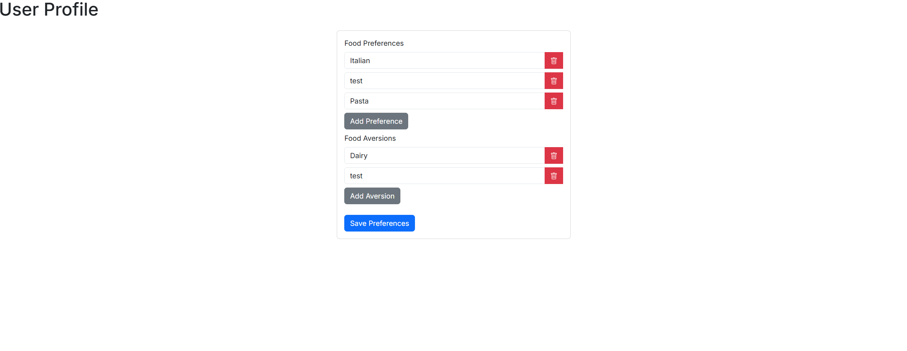

# Welcome to Live-Laugh-Lockheed-Martin

At **Live-Laugh-Lockheed-Martin**, we are dedicated to pushing the boundaries of technology and innovation. Our mission is to create solutions that make the world safer, more connected, and full of possibilities.

## Our Vision

We envision a future where advanced technology and human ingenuity come together to solve the world's most pressing challenges. From aerospace and defense to everyday life, our teams are committed to excellence and innovation.

## What We Do

- **Aerospace Engineering**: Developing cutting-edge aircraft and spacecraft.
- **Cybersecurity**: Safeguarding digital assets with state-of-the-art security solutions.
- **Website Development**: Designing future-forward digital solutions that connect people, power innovation, and enhance global security.

## Manoa Munchies Overview
**Project Title**: Manoa Munchies

**Main Objective**:
The core purpose of this project is to solve the challenge of navigating the wide variety of food options on the University of Hawai‘i at Mānoa campus. With multiple food vendors—such as Campus Center, food trucks, Manoa Gardens, Paradise Palms, and vending machines—students often struggle to find specific types of food or track when a favorite dish is available.

The app will provide students with real-time access to menu items across all campus food locations, filtered by their food preferences. This will simplify decision-making and increase satisfaction by reducing the time and effort spent finding meals they enjoy.

**Key Points of Development for Success**:

- Create a backend system that aggregates menu data from all vendors, allowing real-time updates.

- Organize menu items by location, cuisine type, dietary tags (e.g., vegan, halal), and availability (daily/weekly).

- Users: Can create accounts, set preferences (e.g., exclude allergens, favorite cuisines), and view tailored suggestions.

- Vendors: Can log in to update their daily/weekly menus and manage their vendor profile.

- Admins: Manage user/vendor accounts and oversee system operations.

**Core App Features**

- Search functionality for cuisine types, dishes, and vendors.

- User Home Page

- Vendor Dashboard

- Admin Panel

- Create a simple and quick form for vendors to input and update their menus.

## Manoa Munchies Status
[View our GitHub Project Board](https://github.com/orgs/Live-Laugh-Lockheed-Martin/projects/2/views/1)

**Implemented Features**
So far, we have completed key foundational tasks for the project, including setting up user authentication and deploying the app on Vercel. We’ve also implemented the user preferences feature, allowing users to tailor their food recommendations based on dietary needs or cuisine preferences. Currently, we’re working on enabling vendors to add their menu items and set schedules for when specific dishes will be available.

**Markups**

## Team Contract
**Contribution Criteria**
To determine whether a team member has contributed effectively, we agree to the following
standards:
- Completes assigned tasks on time
- Communicates effectively between group members regarding questions, updates, or
progress
- Collaborates respectfully and constructively with team members

**Behavioral Criteria**
We expect all team members to:
- Give feedback in a respectful and constructive manner
- Listen actively and accept feedback with a positive attitude
- Comes to meetings fully prepared
- Respect agreed-upon roles, deadlines, and expectations
- Maintain a positive and supportive team environment

**Managing Conflict**
In the event of conflict or disagreement, the team will:
1. Provide an opportunity to listen and understand each side of the disagreement
2. Allow for time for reflection and change to ideas after discussion
3. Provide a team vote when needed
4. Bring the issue up to an outside party whether that be an instructor or teaching assistant

**Failure to Honor the Contract**
If a team member fails to meet the expectations outlined in this contract, the following steps will
be taken:
- First instance: Verbal warning from the team
- Second instance: A full team discussion highlighting the problem
- Continued failure: A written report submitted to the instructor

## Join Us

Are you passionate about innovation and technology? We're always looking for talented individuals to join our team. [Explore Careers](#)

## Contact Us

Have questions or need more information? Reach out to us at [contact@livelaughlockheedmartin.com](mailto:contact@livelaughlockheedmartin.com).

---

*Empowering Innovation. Securing the Future.*
