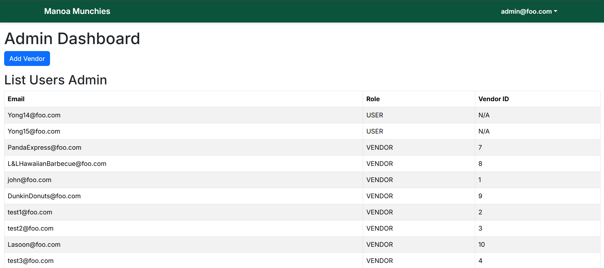

# 🚀 Welcome to Live-Laugh-Lockheed-Martin

## 📑 Table of Contents
- [Welcome to Live-Laugh-Lockheed-Martin](#welcome-to-live-laugh-lockheed-martin)
- [Our Vision](#our-vision)
- [What We Do](#what-we-do)
- [Manoa Munchies Overview](#manoa-munchies-overview)
- [Manoa Munchies Status](#manoa-munchies-status)
- [Team Contract](#-team-contract)
- [Deployment](#-deployment)
- [Screenshots](#-screenshots)
- [Milestone 1 (M1) Project Page](#-milestone-1-m1-project-page)
- [Milestone 2 (M2) Project Page](#️-milestone-2-m2-project-page)
- [GitHub Hosting Guidelines](#-github-hosting-guidelines)
- [Join Us](#join-us)
- [Contact Us](#contact-us)

## 🌍 Our Vision

At **Live-Laugh-Lockheed-Martin**, we are dedicated to pushing the boundaries of technology and innovation. Our mission is to create solutions that make the world safer, more connected, and full of possibilities.

We envision a future where advanced technology and human ingenuity come together to solve the world's most pressing challenges. From aerospace and defense to everyday life, our teams are committed to excellence and innovation.

## 🛠️ What We Do

- **Aerospace Engineering**: Developing cutting-edge aircraft and spacecraft.
- **Cybersecurity**: Safeguarding digital assets with state-of-the-art security solutions.
- **Website Development**: Designing future-forward digital solutions that connect people, power innovation, and enhance global security.

## 🍱 Manoa Munchies Overview
**Project Title**: Manoa Munchies

**Main Objective**:
The core purpose of this project is to solve the challenge of navigating the wide variety of food options on the University of Hawai‘i at Mānoa campus. With multiple food vendors—such as Campus Center, food trucks, Manoa Gardens, Paradise Palms, and vending machines—students often struggle to find specific types of food or track when a favorite dish is available.

The app will provide students with real-time access to menu items across all campus food locations, filtered by their food preferences. This will simplify decision-making and increase satisfaction by reducing the time and effort spent finding meals they enjoy.

**Key Points of Development for Success**:

- Create a backend system that aggregates menu data from all vendors, allowing real-time updates.

- Organize menu items by location, cuisine type, dietary tags (e.g., vegan, halal), and availability (daily/weekly).

- Users: Can create accounts, set preferences (e.g., exclude allergens, favorite cuisines), and view tailored suggestions.

- Vendors: Can log in to update their daily/weekly menus and manage their vendor profile.

- Admins: Manage user/vendor accounts and oversee system operations.

**Core App Features**

- Search functionality for cuisine types, dishes, and vendors.

- User Home Page

- Vendor Dashboard

- Admin Panel

- Create a simple and quick form for vendors to input and update their menus.

## 📊 Manoa Munchies Status
[View our GitHub Repository](https://github.com/eibanezUH/Manoa-Munchies-Nextjs)

[View our GitHub Project Board](https://github.com/orgs/Live-Laugh-Lockheed-Martin/projects/2/views/1)

**Implemented Features**
<!-- Add Menu Item Page -->

This page allows vendors to add new menu items with details like name, description, price, and ingredients.

<!-- Add Vendor Page -->

The Add Vendor page is where new vendors can register their business and provide contact information.

<!-- Admin Dashboard -->

The Admin Dashboard provides admin users with an overview of platform activity and vendor management tools.

<!-- Landing Page -->

The Landing Page serves as the homepage of the application, showcasing its purpose and guiding users to sign in or sign up.

<!-- Sign In Page -->

The Sign In page allows registered users to access their accounts by entering their login credentials.

<!-- Sign Up Page -->

New users can create an account on the Sign Up page by providing their name, email, and password.

<!-- Vendor Dashboard -->

The Vendor Dashboard gives vendors a centralized view of their menu items, schedule, and business performance.

<!-- Vendor Schedule Page -->

This page allows vendors to manage and update their availability or scheduling for specific days.

## 📝 Team Contract  
[View our Team Contract](https://docs.google.com/document/d/1re1sDmqgrhCbOyjak1mA5vgmcGx4IPJbKRek7SYEZfA/edit?tab=t.0)

## 🌐 Deployment 
Our app is deployed and live on Vercel:  
[https://manoa-munchies-nextjs.vercel.app/](https://manoa-munchies-nextjs.vercel.app/)

## ✅ Milestone 1 (M1) Project Page  
[View M1 Project Board](https://github.com/orgs/Live-Laugh-Lockheed-Martin/projects/2)

## 🧱 Milestone 2 (M2) Project Page
[View M2 Project Board](https://github.com/orgs/Live-Laugh-Lockheed-Martin/projects/3)

## 📘 GitHub Hosting Guidelines  
This page adheres to the [GitHub hosting guidelines](https://courses.ics.hawaii.edu/ics314s24/morea/project/milestone1-ghpages.html).

## 💼 Join Us

Are you passionate about innovation and technology? We're always looking for talented individuals to join our team. [Explore Careers](#)

## 📬 Contact Us

Have questions or need more information? Reach out to us at [contact@livelaughlockheedmartin.com](mailto:contact@livelaughlockheedmartin.com).

---

*Empowering Innovation. Securing the Future.*
